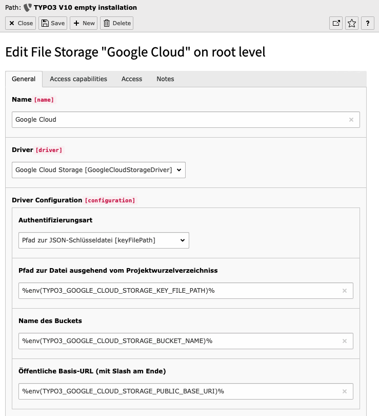
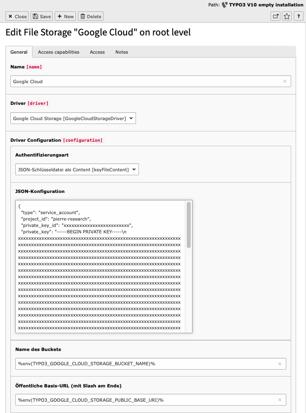

# TYPO3 Google Cloud Storage FAL driver.

This FAL (FileAbstractionLayer) driver allows you to use Google Cloud Storage Buckets in TYPO3 for your assets instead of a local file system. It relies on ```google/cloud-storage``` library to connect to Google.

**Features:**
- Full support of all operations (rename, copy, move, folders, files e.g.).
- Full support of "\_recycler\_" folder.
- Supports multiply buckets & multiply service accounts.
- Stores processed images in google cloud storage.
- Google login credentials can be configured by JSON, ENV or TYPO3 backend.
- Supports base URL configuration per bucket (e.g. for https://cdn.projectname.com/). 
- Supports direct to google storage added files (without using Filelist module).
- Simulates folders, even if google cloud storage is a flat filesystem.
- It comes with caching strategy for higher performance. 
- Migration command to move files from another storage to google cloud storage

It gives you the power to use TYPO3 "cloud native" instead of "cloud ready" on Google Cloud Platform (GCP).

# Installation

The extension should be installed via Composer

```
composer require nextmotion/google-cloud-storage-fal
```

## Configuration

## Google Cloud Storage Configuration

First of all you have to create a bucket on google cloud platform. Second you have to create a private/public key to access the bucket. This driver only supports accesses on a uniform bucket level. 

### CORS Header

To use the TYPO3 crop editor, the CORS headers of the bucket must be configured.

Create a file CORS.json and modify to your needs:  
```
[
    {
      "origin": ["*"],
      "method": ["GET", "POST", "OPTIONS", "HEAD"],
      "responseHeader": ["Authorization", "Origin", "X-Requested-With", "Content-Type", "Accept"],
      "maxAgeSeconds": 3600
    }
]
```

***Warning***: `"origin": ["*"]` means wide open configuration. It's more secure to define your domains e.g. 
`"origin": ["subdomain.domain.tld", "local.dev" ... ] `


Use the command `gsutil cors` to configure CORS in a bucket:
```
# Log-in into your account.
gcloud auth login [MY_ACCOUNT]

# List your projects
gcloud projects list

# Choose project
gcloud config set project [PROJECT_NAME]

# List your buckets
gsutil ls

# Update CORS of your bucket
gsutil cors set CORS.json gs://[BUCKET_NAME]
```

If you want to remove CORS, see: https://cloud.google.com/storage/docs/configuring-cors#remove-cors-bucket

## TYPO3 Configuration

First create a [file storage](https://docs.typo3.org/m/typo3/reference-coreapi/master/en-us/ApiOverview/Fal/Administration/Storages.html).

All configuration fields supports `%env(ENV_VALUE_NAME)%` syntax. 

### Using key file



### Using key file content



## Local `1:_processed_` vs. remote `_processed_` images

It's up to you and depends on your needs where you want to save your _processed_ images. 

If you are trying to develop a cloud-native TYPO3, it makes a lot of sense to store _processed_ images in the Google Cloud Store as well. Once an image is processed, any instance of your TYPO3 can access it. 

# Migrate existing files to google cloud storage 

!!!
**WARNING:** *Backup your TYPO3 database and files before.* 
!!!

Use CLI command `googlecloudstorage:move` to move files from existing storage and keep references.

```
vendor/bin/typo3cms googlecloudstorage:move 1 2
```
Usually `1` is the local file storage and in this example `2` is the Google Cloud Storage bucket.

1. This command read every record in sys_file table with the source storage id (`1`). (Before you start please make sure, that all files are indexed. You can use the planer task "File Abstraction Layer: Update storage index".) 
2. The process download each file from the source to local temp directory.
3. Upload the file from to temp directory the destination storage.
4. Exchanges storage id in the sys_file.
5. Deletes the file in source storage (`1`).

After finishing the command you must clear the processed_files with the module "Maintenance >
Remove Temporary Assets > Scan temporary files > Delete files in _proccessed_".

*Note: Due technical limitations the created and modified date will set to the current timestamp.*

```
vendor/bin/typo3cms googlecloudstorage:move [-f|--force [FORCE]] [--filter FILTER] [--limit LIMIT] [--exclude EXCLUDE] [--] <source> <target>

Usage:
  googlecloudstorage:move [options] [--] <source> <target>
  google_cloud_storage_fal:googlecloudstorage:move

Arguments:
  source                 Source storage identifier
  target                 Target storage identifier

Options:
  -f, --force[=FORCE]    never prompt
                          • [default: false]
      --filter=FILTER    Filter pattern with possible wild cards, --filter="%.pdf"
                          • [default: ""]
      --limit=LIMIT      Add a possible offset, limit to restrain the number of files. e.g. 0,100
                          • [default: ""]
      --exclude=EXCLUDE  Exclude pattern, can contain comma separated values e.g. --exclude="/apps/%,/_temp/%"
                          • [default: ""]

```

# Limitations

- Supports only uniform buckets-level access. Read more at https://cloud.google.com/storage/docs/uniform-bucket-level-access.

# Known issues

* Google doesn't support directories because it is a flat filesystem like a key value storage. Directories are simulate in GCS trough empty files with trailing a slash (e.g. "`images/`"). This driver support both: The driver shows the simulated directories. If a simulated parent directory to a file is missing, the driver fakes the existing virtual directory. As a result its good to keep in mind: if you delete the last file in `images/`, e.g. `images/product.jpg`, and there is no parent virtual directory, the parent directory will also disappear from the file list. 

# Credits

This extension was created by Pierre Geyer in 2020 for next.motion OHG, Gera.
